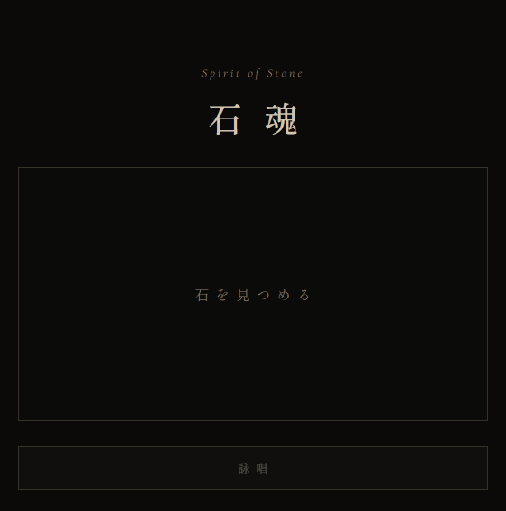
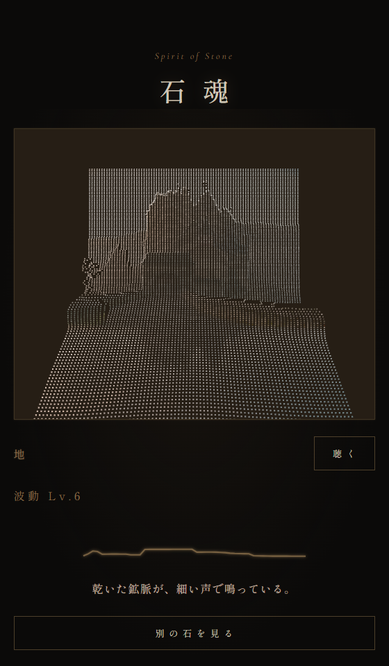

# 石魂 ～Spirit of Stone～

石の写真から深度を推定し、点群・波動・歌として可視化する Web MVP。

- 公開サイト: [https://ishitama.vercel.app/](https://ishitama.vercel.app/)
- ソースコード: [https://github.com/plaodas/ishitama](https://github.com/plaodas/ishitama)

## キャプチャ

初期画面。石の写真を選んで「詠唱」する。(スマホではカメラ起動)



詠唱後。深度から点群を生成し、音色・波動・メッセージを返す。



## できること

- 石の写真（jpg / png）から Depth Anything V2 Small で深度を推定
- 中央と外周の深度差から石領域を切り出し、背景を除いて点群化する
- 点群として立体を表示（Three.js）
- 色と深度から 12 種類の音色を割り当て、Tone.js で再生
- 中央ラインの波動と点群の呼吸・明滅を音の Pulse に同期
- 石の音色と、背景の明るさ・色・ざわつき、端末の時刻から短い文を毎回生成する
- 画像はサーバに保存せず、メモリ上で処理して応答後に破棄

## 構成

| 領域 | 技術 | ホスト |
| --- | --- | --- |
| `frontend/` | Vite + React + Three.js + Tone.js | [Vercel](https://ishitama.vercel.app/) |
| `backend/` | FastAPI + ONNX Runtime CPU |  [Railway](https://railway.com/) |
| 文の生成 | Ollama + `qwen2.5:3b`（CPU） | ローカルの別コンテナ |

深度推定は Depth Anything V2 Small の ONNX を CPU で実行する。デプロイサイズとコストを重視するため、PyTorch CUDA 一式は載せない。文の生成も GPU は使わない。

## 処理

`POST /api/stone/analyze` はメモリ上で次の順に進む。画像は保存せず、応答後に破棄する。

1. 画像を最大辺 384px に縮小する
2. Depth Anything V2 Small（ONNX / CPU）で相対深度を推定する
3. 石マスクを作る（中央の代表深度と外周の背景深度を比較し、勾配の急な境界は越えない。中央からつながった領域だけ残す。面積が極端なら中央楕円にフォールバックする）
4. マスク内だけを最大約 1 万点まで点群化し、石の中心を原点に合わせる
5. マスク内の色と凹凸から音色（instrument / pitch / noise / bpm）を決める
6. マスク内の横断面から波動プロファイルを作る
7. 石の音色・強さ・音程と、マスク外の背景（明るさ・色・ざわつき）、端末の時刻を短い日本語にし、同じ楽器の例文を3つ添えて Ollama に渡す。温度 0.9 で一文を毎回生成する。石が画面の大半を占めるときは背景を読まない。Ollama が応答しないときは、108文の表から一文を返す

フロントは点群を Three.js で表示し、「聴く」で Tone.js の Drone / Noise / Pulse を再生する。Pulse に合わせて波動ラインと点群が明滅する。

## ローカル起動

別ターミナルでバックエンドとフロントを起動する。

### バックエンド

```bash
cd backend
python3 -m venv .venv
source .venv/bin/activate
pip install --upgrade pip
pip install -r requirements.txt
pip install -r requirements-dev.txt
export BACKEND_CORS_ORIGINS="http://localhost:3000,http://127.0.0.1:3000"
uvicorn app.main:app --reload --port 8000
```

初回起動時に GitHub Release から Depth Anything V2 Small の ONNX を取得する。`DEPTH_MODEL_PATH` でローカルファイルを指定してもよい。メモリは 2GB 以上を想定。

文の生成には、同じマシンで Ollama が `qwen2.5:3b` を配信している必要がある。未起動のときは表の文に戻る。接続先は `OLLAMA_BASE_URL`（既定 `http://localhost:11434`）、モデル名は `OLLAMA_MODEL`（既定 `qwen2.5:3b`）。

### フロントエンド

```bash
cd frontend
cp .env.example .env.local
npm install
npm run dev
```

ブラウザで `http://localhost:3000` を開き、石の写真を選んで「詠唱」する。

## API

`POST /api/stone/analyze`

- 入力: `multipart/form-data` の `image`（jpg / png、8MB まで）と `hour`（端末の時、0–23。省略可）
- 出力: `pointCloud` / `sound` / `wave` / `message`

## Docker

リポジトリ直下で Ollama とバックエンドを一緒に起動する。フロントは別途 `npm run dev`。

```bash
docker compose up --build
```

- `ollama` はモデルをボリューム `ollama-data`（`/root/.ollama`）に置く。イメージを作り直しても、ボリュームが残っていれば再ダウンロードしない
- `ollama-init` は初回に `qwen2.5:3b`（約 2GB）を取得する
- `backend` は取得後に起動し、モデルをメモリへ載せる

深度推定と文の生成を同時に載せるため、メモリは 4GB 以上を想定する。

バックエンドだけを起動する場合は、Ollama が無いので文は表から選ばれる。

```bash
cd backend
docker build -t ishitama-api .
docker run --rm -p 8000:8000 -e BACKEND_CORS_ORIGINS="http://localhost:3000" ishitama-api
```

本番では frontend を Vercel、backend を Railway に載せている。Railway はメモリ 2GB 以上、リクエストタイムアウト 60 秒以上を想定する。フロントの `VITE_API_URL` にバックエンド URL を設定する。Railway から Ollama へ届かない場合、文は表に戻る。

## 静的解析

```bash
make lint
```

- フロント: ESLint（TypeScript + React Hooks）と `tsc --noEmit`
- バックエンド: Ruff（lint / format）と mypy

自動修正は `make lint-fix`。フロントだけなら `cd frontend && npm run lint`、バックエンドだけなら `cd backend && ruff check app`。

## ライセンス

[MIT License](LICENSE)
